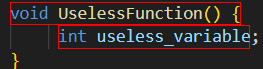
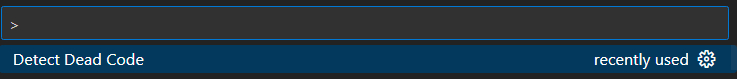
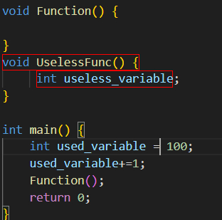

# Dead Code Detector

## Описание
Плагин реализован на **TypeScript** с использование **API Visual Studio Code**. Предназначен в первую очередь для проектов **Visual Studio Code** на **C++**. Он находит и выделяет объявленные, но не используемые в коде функции и переменные 



> Примечание: Плагин хоть сделан в расчете на работу на **C++**, но может быть сравнительно просто адаптирован и под другие языки.

## Технологии

- Язык реализации: **TypeScript**
- IDE: **Visual Studio Code**
- API: **Visual Studio Code Extension API**
- Целевой язык: **C++**


## Активация
В файл ***package.json*** добавлена команда *Detect dead code*.
```Typescript
commands": [
      {
        "command": "extension.detectDeadCode",
        "title": "Detect Dead Code"
      }
    ]
```
- "command": "extension.detectDeadCode" - добавляет в расширение команду.
- "title": "Detect Dead Code" - добавляет название, с которым она будет отображаться в палитре команд.

Для того, чтобы найти в своём коде неиспользумые функции или переменные при их наличии, нужно выполнить вызов команды *Detect dead code* в command palette.


## Реализация

### Структура:

- **package.json**: Содержит метаинформацию о плагине - его команды, настройки активации и зависимости.
- **src/extensions.ts**:  Содержит логику реализации плагина.
- **docs** : Содержит документацию и иллюстрационные изображения.
Это *главные* единицы структуры.

### Основные функции
####  Создание декорации
```TypeScript 
const red_highlight = vscode.window.createTextEditorDecorationType({
	backgroundColor: 'rgba(255,0,0,0)',
	border: '1px solid red',
})
```
- vscode.window.createTextEditorDecorationType(): Создает декорацию для текста кода. Здесь это красная табличка.
#### Регистрация команды
```TypeScript
const disposable = vscode.commands.registerCommand('extension.detectDeadCode', () => {
		const editor = vscode.window.activeTextEditor;
		if (!editor) {
			vscode.window.showErrorMessage('Invalid call!');
			return;
		}
```
- vscode.commands.registerCommand(): Регистрирует команду.
- vscode.window.showErrorMessage: Выводит сообщение в случае некорректного вызова.
#### Очищение декораций при предыдущем вызове
```TypeScript
editor.setDecorations(red_highlight, []);
```
- editor.setDecorations(red_highlight, []): очищает декорации("устанавливает" их на пустой массив текстовых символов)
#### Установление декорации
```TypeScript
editor.setDecorations(red_highlight, unused);
```
- editor.setDecorations(red_highlight, unused): Устанавливает декорации на массив неиспользуемых элементов кода.
> Примечание: об unused далее.
#### Поиск "мёртвого кода"
##### Для переменных

Cначала определяется регулярное выражение
```TypeScript 
const variable_regular = /\b(int|float|double|char|std::string|bool|auto)\s+([a-zA-Z_][a-zA-Z0-9_]*)\b(?!\s*\()/g
```
Затем следует логика обработки текста документа
```TypeScript 
while ((match = variable_regular.exec(text)) !== null) {
			const [full_match, , part_of_variable] = match;
			const begin = editor.document.positionAt(match.index);
			const end = editor.document.positionAt(match.index + match[0].length);
			const variable_length = new vscode.Range(begin, end);
```
- exec(text): Проверяет на соотвествие регулярному выражению в тексте.
positionAt(index): находит позиции начала, затем конца совпадения. Тип данных включается.
- vscode.Range(begin, end): определяет все позции в тексте от начало до конца объявления переменной. Заканичивает именем и не включает само значение.
```TypeSript
if (!text.includes(part_of_variable, match.index + match[0].length) ) {
				unused.push({
					range: variable_length,
					hoverMessage: `Unused variable: ${part_of_variable},
				}

```
- inludes(name, idex): Проверяет, есть ли далее в тексте название.
- push(): Добавляет название переменной в массив неиспользуемых элементов кода. 

##### Для функций
Логика в целом схожа с нахождением неиспользуемых переменных, но сделано исключение для функции main()
```TypeScript
if (function_name == 'main') {
					continue;
				}
```

## Пример на коде

